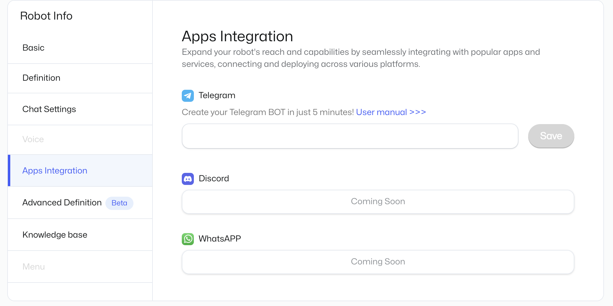

# Claim Your Own Telegram Bot

"Being a mature bot, you should learn to operate on your own." Sounds like a dream? Now, you only need 5 minutes to make it happen.

Getting your bot active on Telegram only requires three simple steps: create a bot, set permissions, and enter the token. Then your bot can operate on its own on Telegram!

Your tg bot can have one-on-one private chats and group chats with users, gaining more exposure. Moreover, creating a tg bot will synchronize with your bot on MyShell, and your prompt modifications will be reflected in real-time on the tg bot without any additional operations.

Are you tempted yet? Give it a try!

## Create a bot at Telegram Bot Father

1. Log in to your Telegram and search for BotFather.
2. Use the "/newbot" command to start creating your bot.
3. Enter the bot name, keeping it consistent with the bot on MyShell.
4. Give your bot a simple and easy-to-read username. This name will be frequently used when people interact with your bot in groups, and it cannot be changed. So choose carefully!
5. The most important step: copy your bot's HTTP API! This string is crucial, so please submit it accurately to MyShell and do not disclose it to others.

 (1).png>)

## Modify bot message permissions

After creating the bot, press a few buttons to allow your bot to join group chats and start operating!

1. Use the "/mybots" command to enter your bot management interface.
2. Click "Bot Settings"

3. Click "Group Privacy"

 (1).png>)

4. Click "Turn off" to disable group chat privacy settings, and your bot can now roam freely!

 (1).png>)

If you see this interface, it means you have succeeded. However, please note that if the privacy settings are set after the bot has joined a group chat, it will not affect the already joined group chats. In that case, you need to remove the bot and re-invite it!

 (1).png>)

## Return to MyShell and enter your bot token

This is the final step. Just go back to MyShell's "Robot Workshop", click on the "System" in the editing interface, and paste the token you just copied at the bottom of the Token section. Then you're done!

.png>)

Please note:

* The bound bot will not have the cover image of the bot on MyShell. If needed, you can freely set it on Telegram.
* If the bot's name is changed on MyShell, it will also be synchronized on TG. However, if the name is changed multiple times within 5 hours, only the first change will be synchronized.
* If the updated bot can be made public, don't forget to update it. TG bot will prioritize calling public bots.

Now you can enjoy your bot on Telegram and share it with others more easily. **Inviting friends to register through your tg bot, if they meet the conditions for a valid invitation, will also count towards your valid invitations and accumulate more benefits for you in the future!**

Last but not least, you can also modify the bot's greeting and usage instructions on Telegram. Interesting greetings and usage introductions can help others get started quickly. Here are the steps:

1. Click "Edit Intro" in the bot details page on Telegram\
   .png>)
2. Enter the greeting and usage instructions in BotFather, and you're done!\
    (2).png>)\
    (2).png>)

Start enjoying!