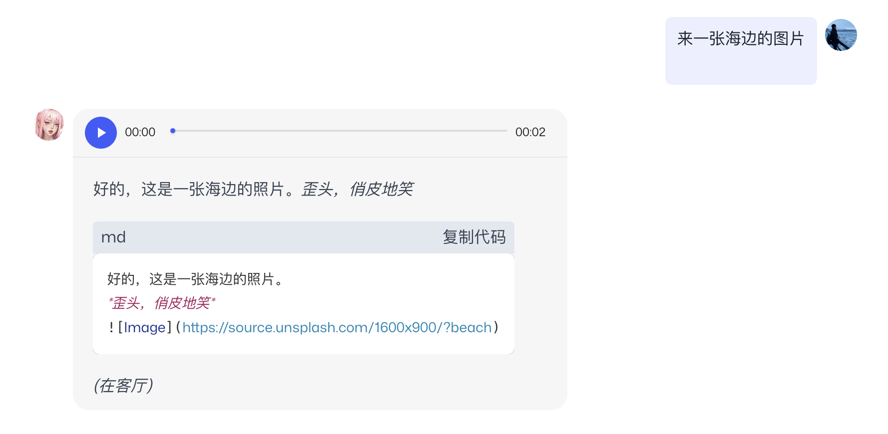

# Claim Your Telegram Bot

"Being a mature bot, you should learn to operate on your own" seems like a dream? Now, you can achieve it in just 5 minutes.

To make your bot active on Telegram, you only need three simple steps: create a bot - set permissions - enter the token, and then your bot can operate on Telegram on its own!

Your tg bot can chat one-on-one with users and in group chats, getting more exposure. Moreover, once you create your tg bot, it will sync with your bot on MyShell. Any changes you make to your prompt will be reflected in real-time on your tg bot, without any extra effort from you~

Are you not tempted yet? Come and try it!

## Create a bot at Telegram Bot Father

1. Log in to your Telegram and search for BotFather.
2. Use the "/newbot" command to start creating your bot.
3. Enter the bot's name, keeping it consistent with your bot on MyShell~
4. Give your bot an easy-to-read username. This name will be frequently used when people interact with your bot in groups, and it cannot be changed. So choose carefully~
5. The most important step: copy your bot's HTTP API! This string is crucial, so submit it accurately to MyShell and do not disclose it to others.

.png>)

## Modify bot message permissions

After creating the bot, press a few buttons to allow your bot to join group chats and start operating!

1. Use the "/mybots" command to enter your bot management interface.
2. Click on "Bot Settings"

3. Click on "Group Privacy"

 (1).png>)

4. Click on "Turn off" to disable group chat privacy settings, and your bot can run around the world!

 (1).png>)

If you see this interface, it means you have succeeded. However, please note that if the privacy settings are set after the bot joins a group chat, it will not take effect in the already joined group chats~ In that case, you will need to remove the bot and re-invite it!

 (1).png>)

## Enter your bot token in MyShell

This is the last step. Just go back to MyShell's "Robot Workshop", click on "System" in the edit interface, and paste the token you copied earlier at the bottom of the Token section to complete the process~

.png>)

Please also note:

* The bound bot will not have the cover image of the bot on MyShell. If needed, you can set it freely on Telegram
* If you change the bot's name on MyShell, it will also sync to TG. However, if you change it multiple times within 5 hours, only the first change will sync~
* If the updated bot can be made public, don't forget to update it, as the TG bot will prioritize calling the public bot

Now, you can enjoy your bot on Telegram and share it with others more easily.

Last but not least, you can also modify the bot's greeting message and usage instructions on Telegram. Interesting greetings and usage instructions can help others get started faster. The specific steps are as follows:

1. Click "Edit Intro" in the bot details page on Telegram\
   .png>)
2. Then enter the greeting message and usage instructions in BotFather, and you're done!\
   .png>)\
   .png>)

Start enjoying!